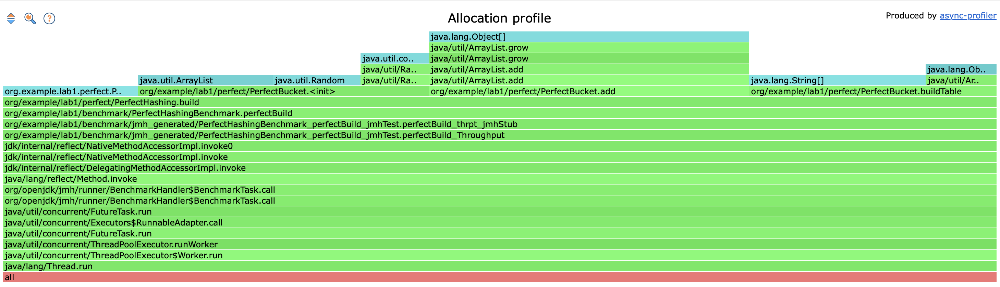
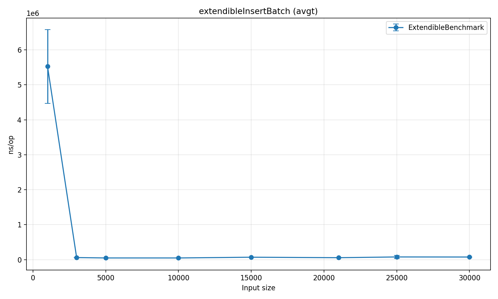

# Алгоритмы

Содержание:
- [1 - Хэширование](#Хэширование)
  - [Perfect hashing](#Perfect-hashing)
  - [Extensible hashing](#Extensible-hashing)
  - [Lsh](#Lsh)

## Хэширование

### Perfect hashing
Алгоритм perfect hashing позволяет создавать хэш-таблицы, которые гарантируют O(1) время доступа к элементам. 
Он использует два уровня хэширования: первый для распределения ключей, а второй - для разрешения коллизий.
Таким в каждой корзине находятся элементы с уникальными значениями хэш-функции.

Построение perfect hash-таблицы требует O(n) времени, где n - количество ключей.

Все alloc памяти сделаны только для внутренних структур данных

### **FIX!** 
После внесения правок (перераспределение значений между бакетами при ограничении попыток вычисления неповторяющихся хэш-функций внутри бакета), затраты на выделение памяти под массивы уменьшилось

Больше всего CPU расходует вычисление hash-функции

get выполняется за O(1)

### FIX! 
При увеличении количества элементов в таблице и получении 500 рандомных ключей из возможных:

В случае получения одинакового пула ключей видно отсутствие линейной зависимости:

Аллокаций нет

Больше всего CPU расходует вычисление hash функции

### Extensible hashing
Алгоритм extensible hashing позволяет динамически расширять хэш-таблицу при добавлении новых элементов. 

Вставка осуществляется за O(1), но иногда сильно проседает - вероятно, связано с фоновыми процессами и неидеальным измерением, поскольку видны сильные отклонения от среднего значения. Также может быть связано с проверкой существования ключа в бакете

### FIX!
Повторные эксперименты с вставкой батчами показали, что заметнее всего просадки на малом числе элементов - поскольку часто нужно сплитить бакеты и перемещать элементы.
На больших значениях вставка больше похожа на O(1).

Память затрачена на создание файлов

Больше всего CPU уходит на создание файлов и доступ к ним для записи. Можно улучшить буферной записью

### FIX!

При буферизованой записи граф выглядит следующим образом:

Получение записи выполняется за O(1)

Get при рандомном доступе по ключам аллоцирует новые участки памяти через mmap

CPU уходит на работу с буфером и сравнение ключей

### Lsh
Lsh (Locality-Sensitive Hashing) - это алгоритм для поиска похожих элементов в больших наборах данных. 
Он использует хэш-функции, которые сохраняют локальную структуру данных, что позволяет эффективно находить похожие элементы.

Вставка выполняется за O(1)

Аллокации осуществляются для формирования "полосок". Можно не "мапить" их в процессе вставки, а просматривать биты только при поиске

Большую часть времени занимает работа с внутренними коллекциями и вычисление хэш-функции

Поиск выполняется за O(n)

Аллокация осуществляется для найденных соседей искомой ноды. Можно улучшить поменяв порядок обработки - сразу проходиться по полученным точкам без формирования новой мапы

Процессорное время также тратится на формирование новой hashMap и итератор. Путь улучшения - аналогичный памяти

