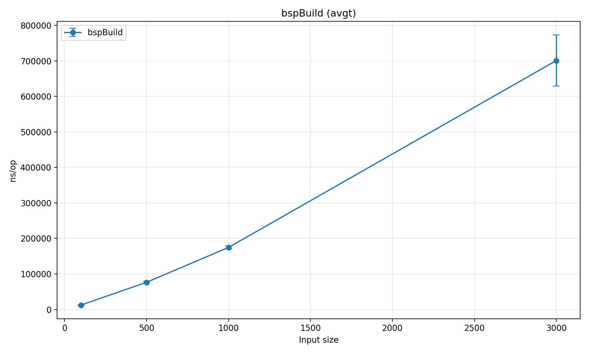
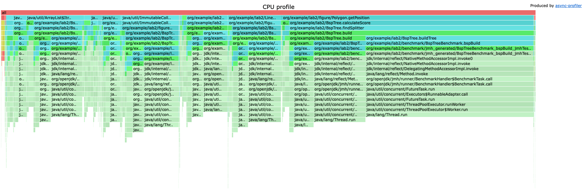
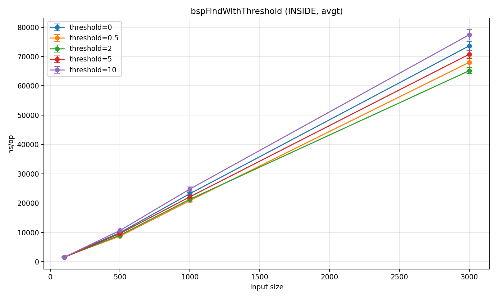
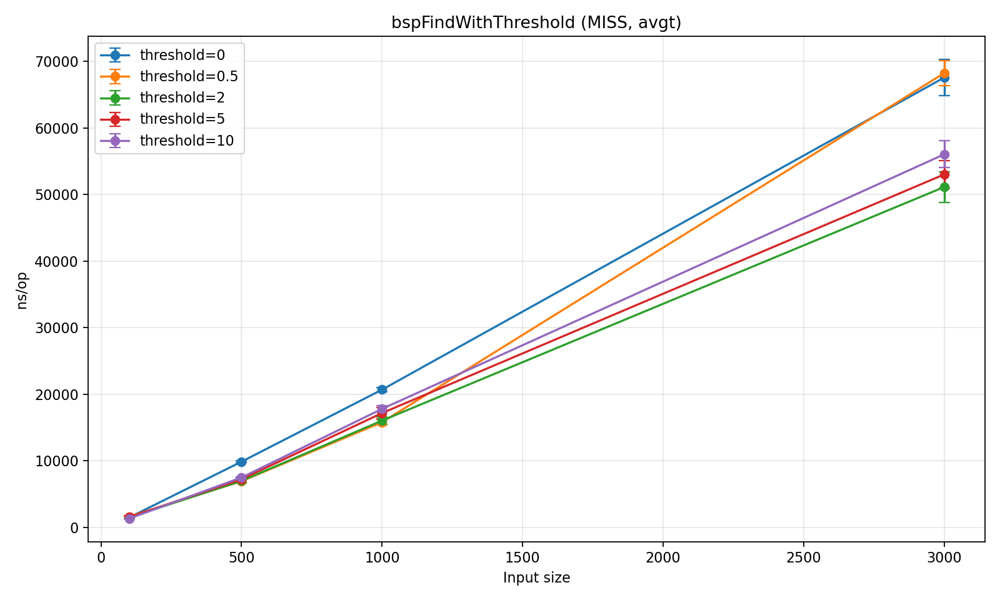
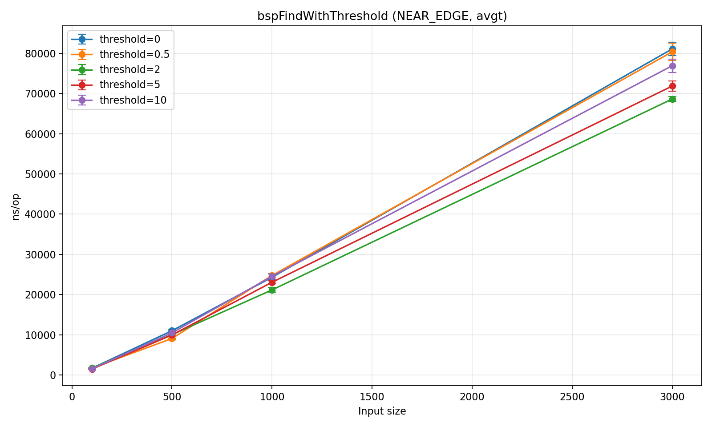
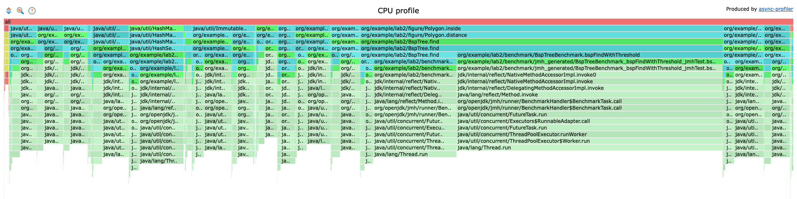

## Деревья

BSP (Binary Space Partitioning) - это алгоритм для разбиения пространства на части с помощью гиперплоскостей.
Построение BSP-дерева может занимать O(n log n) времени. Поиск в BSP-дереве может выполняться за O(log n) в среднем случае, при сильном дисбалансе - O(n).
Использовался для движков Doom и Quake, а также для рендеринга в 3D-играх.

Время зависит от количества полигонов, причем не квадратично, а скорее логарифмически или линейно

По flame-graph видно, что большая часть времени уходит на выбор оптимальной линии разбиения.
Как вариант ускорения - уменьшить число кандидатов на линию разбиения или кэшировать позицию фигуры относительно кандидата

Для поиска тесты осуществлялись на разных уровнях порогов, количестве фигур и расположении искомых точек - внутри фигуры, снаружи около границы и вдалеке от них.
Заметен рост времени при увеличении количества фигур, а также при изменении threshold - при его увеличении растет время из-за увеличения зоны поиска.

Большая часть времени уходит на вычисление расстояния до полигона.
Можно считать расстояние до его центра, либо определять некоторый bounding box и считать расстояние до него

| Benchmark                             | (queryType) | (size) | (threshold) | Mode | Cnt | Score                  | Error     | Units |
|---------------------------------------|-------------|--------|-------------|------|-----|------------------------|-----------|-------|
| BspTreeBenchmark.bspBuild             | INSIDE      | 100    | 0.0         | avgt | 15  | 12053,136 ±            | 216,322   | ns/op |
| BspTreeBenchmark.bspBuild             | INSIDE      | 100    | 0.5         | avgt | 15  | 11988,965 ±            | 140,379   | ns/op |
| BspTreeBenchmark.bspBuild             | INSIDE      | 100    | 2.0         | avgt | 15  | 12159,362 ±            | 322,079   | ns/op |
| BspTreeBenchmark.bspBuild             | INSIDE      | 100    | 5.0         | avgt | 15  | 12081,612 ±            | 301,360   | ns/op |
| BspTreeBenchmark.bspBuild             | INSIDE      | 100    | 10.0        | avgt | 15  | 12106,924 ±            | 249,306   | ns/op |
| BspTreeBenchmark.bspBuild             | INSIDE      | 500    | 0.0         | avgt | 15  | 75985,994 ±            | 1693,369  | ns/op |
| BspTreeBenchmark.bspBuild             | INSIDE      | 500    | 0.5         | avgt | 15  | 75972,905 ±            | 1385,329  | ns/op |
| BspTreeBenchmark.bspBuild             | INSIDE      | 500    | 2.0         | avgt | 15  | 80821,908 ±            | 7785,592  | ns/op |
| BspTreeBenchmark.bspBuild             | INSIDE      | 500    | 5.0         | avgt | 15  | 79181,779 ±            | 6712,016  | ns/op |
| BspTreeBenchmark.bspBuild             | INSIDE      | 500    | 10.0        | avgt | 15  | 77643,321 ±            | 4373,801  | ns/op |
| BspTreeBenchmark.bspBuild             | INSIDE      | 1000   | 0.0         | avgt | 15  | 188241,374 ±           | 12683,372 | ns/op |
| BspTreeBenchmark.bspBuild             | INSIDE      | 1000   | 0.5         | avgt | 15  | 181096,049 ±           | 10404,697 | ns/op |
| BspTreeBenchmark.bspBuild             | INSIDE      | 1000   | 2.0         | avgt | 15  | 173456,758 ±           | 6159,483  | ns/op |
| BspTreeBenchmark.bspBuild             | INSIDE      | 1000   | 5.0         | avgt | 15  | 177893,811 ±           | 6988,162  | ns/op |
| BspTreeBenchmark.bspBuild             | INSIDE      | 1000   | 10.0        | avgt | 15  | 180380,554 ±           | 9775,208  | ns/op |
| BspTreeBenchmark.bspBuild             | INSIDE      | 3000   | 0.0         | avgt | 15  | 699886,640 ±           | 27356,215 | ns/op |
| BspTreeBenchmark.bspBuild             | INSIDE      | 3000   | 0.5         | avgt | 15  | 703040,544 ±           | 61805,902 | ns/op |
| BspTreeBenchmark.bspBuild             | INSIDE      | 3000   | 2.0         | avgt | 15  | 712472,497 ±           | 41292,243 | ns/op |
| BspTreeBenchmark.bspBuild             | INSIDE      | 3000   | 5.0         | avgt | 15  | 733333,199 ±           | 54263,386 | ns/op |
| BspTreeBenchmark.bspBuild             | INSIDE      | 3000   | 10.0        | avgt | 15  | 675610,218 ±           | 12894,423 | ns/op |
| BspTreeBenchmark.bspBuild             | NEAR_EDGE   | 100    | 0.0         | avgt | 15  | 11896,767 ±            | 176,888   | ns/op |
| BspTreeBenchmark.bspBuild             | NEAR_EDGE   | 100    | 0.5         | avgt | 15  | 11917,381 ±            | 73,917    | ns/op |
| BspTreeBenchmark.bspBuild             | NEAR_EDGE   | 100    | 2.0         | avgt | 15  | 11917,809 ±            | 106,478   | ns/op |
| BspTreeBenchmark.bspBuild             | NEAR_EDGE   | 100    | 5.0         | avgt | 15  | 12493,965 ±            | 1037,412  | ns/op |
| BspTreeBenchmark.bspBuild             | NEAR_EDGE   | 100    | 10.0        | avgt | 15  | 11897,130 ±            | 69,957    | ns/op |
| BspTreeBenchmark.bspBuild             | NEAR_EDGE   | 500    | 0.0         | avgt | 15  | 74084,389 ±            | 859,794   | ns/op |
| BspTreeBenchmark.bspBuild             | NEAR_EDGE   | 500    | 0.5         | avgt | 15  | 76195,793 ±            | 2634,609  | ns/op |
| BspTreeBenchmark.bspBuild             | NEAR_EDGE   | 500    | 2.0         | avgt | 15  | 75817,048 ±            | 1832,093  | ns/op |
| BspTreeBenchmark.bspBuild             | NEAR_EDGE   | 500    | 5.0         | avgt | 15  | 77160,850 ±            | 2014,520  | ns/op |
| BspTreeBenchmark.bspBuild             | NEAR_EDGE   | 500    | 10.0        | avgt | 15  | 75627,948 ±            | 2004,583  | ns/op |
| BspTreeBenchmark.bspBuild             | NEAR_EDGE   | 1000   | 0.0         | avgt | 15  | 180622,144 ±           | 11994,655 | ns/op |
| BspTreeBenchmark.bspBuild             | NEAR_EDGE   | 1000   | 0.5         | avgt | 15  | 182100,315 ±           | 10956,520 | ns/op |
| BspTreeBenchmark.bspBuild             | NEAR_EDGE   | 1000   | 2.0         | avgt | 15  | 174265,891 ±           | 3825,849  | ns/op |
| BspTreeBenchmark.bspBuild             | NEAR_EDGE   | 1000   | 5.0         | avgt | 15  | 175246,833 ±           | 6882,275  | ns/op |
| BspTreeBenchmark.bspBuild             | NEAR_EDGE   | 1000   | 10.0        | avgt | 15  | 179390,925 ±           | 11128,489 | ns/op |
| BspTreeBenchmark.bspBuild             | NEAR_EDGE   | 3000   | 0.0         | avgt | 15  | 695345,845 ±           | 17872,982 | ns/op |
| BspTreeBenchmark.bspBuild             | NEAR_EDGE   | 3000   | 0.5         | avgt | 15  | 689235,967 ±           | 23022,489 | ns/op |
| BspTreeBenchmark.bspBuild             | NEAR_EDGE   | 3000   | 2.0         | avgt | 15  | 699194,339 ±           | 18423,482 | ns/op |
| BspTreeBenchmark.bspBuild             | NEAR_EDGE   | 3000   | 5.0         | avgt | 15  | 708759,316 ±           | 24286,714 | ns/op |
| BspTreeBenchmark.bspBuild             | NEAR_EDGE   | 3000   | 10.0        | avgt | 15  | 683249,234 ±           | 13464,876 | ns/op |
| BspTreeBenchmark.bspBuild             | MISS        | 100    | 0.0         | avgt | 15  | 12084,371 ±            | 329,998   | ns/op |
| BspTreeBenchmark.bspBuild             | MISS        | 100    | 0.5         | avgt | 15  | 11897,638 ±            | 161,333   | ns/op |
| BspTreeBenchmark.bspBuild             | MISS        | 100    | 2.0         | avgt | 15  | 11825,213 ±            | 49,214    | ns/op |
| BspTreeBenchmark.bspBuild             | MISS        | 100    | 5.0         | avgt | 15  | 11947,237 ±            | 157,412   | ns/op |
| BspTreeBenchmark.bspBuild             | MISS        | 100    | 10.0        | avgt | 15  | 12151,871 ±            | 367,536   | ns/op |
| BspTreeBenchmark.bspBuild             | MISS        | 500    | 0.0         | avgt | 15  | 75784,376 ±            | 1690,940  | ns/op |
| BspTreeBenchmark.bspBuild             | MISS        | 500    | 0.5         | avgt | 15  | 80537,239 ±            | 6990,995  | ns/op |
| BspTreeBenchmark.bspBuild             | MISS        | 500    | 2.0         | avgt | 15  | 75746,480 ±            | 1235,972  | ns/op |
| BspTreeBenchmark.bspBuild             | MISS        | 500    | 5.0         | avgt | 15  | 77460,219 ±            | 4153,598  | ns/op |
| BspTreeBenchmark.bspBuild             | MISS        | 500    | 10.0        | avgt | 15  | 76613,842 ±            | 2680,430  | ns/op |
| BspTreeBenchmark.bspBuild             | MISS        | 1000   | 0.0         | avgt | 15  | 190877,154 ±           | 12773,924 | ns/op |
| BspTreeBenchmark.bspBuild             | MISS        | 1000   | 0.5         | avgt | 15  | 180545,983 ±           | 8523,634  | ns/op |
| BspTreeBenchmark.bspBuild             | MISS        | 1000   | 2.0         | avgt | 15  | 181320,078 ±           | 9753,208  | ns/op |
| BspTreeBenchmark.bspBuild             | MISS        | 1000   | 5.0         | avgt | 15  | 186641,271 ±           | 7713,805  | ns/op |
| BspTreeBenchmark.bspBuild             | MISS        | 1000   | 10.0        | avgt | 15  | 178475,283 ±           | 5045,025  | ns/op |
| BspTreeBenchmark.bspBuild             | MISS        | 3000   | 0.0         | avgt | 15  | 683790,790 ±           | 20104,215 | ns/op |
| BspTreeBenchmark.bspBuild             | MISS        | 3000   | 0.5         | avgt | 15  | 854443,803 ±321594,887 | ns/op     |
| BspTreeBenchmark.bspBuild             | MISS        | 3000   | 2.0         | avgt | 15  | 698226,883 ±           | 36514,282 | ns/op |
| BspTreeBenchmark.bspBuild             | MISS        | 3000   | 5.0         | avgt | 15  | 727441,914 ±           | 52659,698 | ns/op |
| BspTreeBenchmark.bspBuild             | MISS        | 3000   | 10.0        | avgt | 15  | 667393,245 ±           | 20011,742 | ns/op |
| BspTreeBenchmark.bspFindWithThreshold | INSIDE      | 100    | 0.0         | avgt | 15  | 1612,193 ±             | 22,132    | ns/op |
| BspTreeBenchmark.bspFindWithThreshold | INSIDE      | 100    | 0.5         | avgt | 15  | 1640,701 ±             | 40,525    | ns/op |
| BspTreeBenchmark.bspFindWithThreshold | INSIDE      | 100    | 2.0         | avgt | 15  | 1451,686 ±             | 53,435    | ns/op |
| BspTreeBenchmark.bspFindWithThreshold | INSIDE      | 100    | 5.0         | avgt | 15  | 1484,902 ±             | 23,975    | ns/op |
| BspTreeBenchmark.bspFindWithThreshold | INSIDE      | 100    | 10.0        | avgt | 15  | 1549,612 ±             | 22,210    | ns/op |
| BspTreeBenchmark.bspFindWithThreshold | INSIDE      | 500    | 0.0         | avgt | 15  | 10119,239 ±            | 306,420   | ns/op |
| BspTreeBenchmark.bspFindWithThreshold | INSIDE      | 500    | 0.5         | avgt | 15  | 8684,267 ±             | 128,248   | ns/op |
| BspTreeBenchmark.bspFindWithThreshold | INSIDE      | 500    | 2.0         | avgt | 15  | 9025,842 ±             | 203,106   | ns/op |
| BspTreeBenchmark.bspFindWithThreshold | INSIDE      | 500    | 5.0         | avgt | 15  | 9930,519 ±             | 327,983   | ns/op |
| BspTreeBenchmark.bspFindWithThreshold | INSIDE      | 500    | 10.0        | avgt | 15  | 10845,617 ±            | 437,104   | ns/op |
| BspTreeBenchmark.bspFindWithThreshold | INSIDE      | 1000   | 0.0         | avgt | 15  | 23644,883 ±            | 729,483   | ns/op |
| BspTreeBenchmark.bspFindWithThreshold | INSIDE      | 1000   | 0.5         | avgt | 15  | 21823,507 ±            | 566,678   | ns/op |
| BspTreeBenchmark.bspFindWithThreshold | INSIDE      | 1000   | 2.0         | avgt | 15  | 22081,214 ±            | 1077,906  | ns/op |
| BspTreeBenchmark.bspFindWithThreshold | INSIDE      | 1000   | 5.0         | avgt | 15  | 23034,975 ±            | 1011,953  | ns/op |
| BspTreeBenchmark.bspFindWithThreshold | INSIDE      | 1000   | 10.0        | avgt | 15  | 25069,614 ±            | 690,792   | ns/op |
| BspTreeBenchmark.bspFindWithThreshold | INSIDE      | 3000   | 0.0         | avgt | 15  | 74496,540 ±            | 1338,578  | ns/op |
| BspTreeBenchmark.bspFindWithThreshold | INSIDE      | 3000   | 0.5         | avgt | 15  | 69301,675 ±            | 5009,072  | ns/op |
| BspTreeBenchmark.bspFindWithThreshold | INSIDE      | 3000   | 2.0         | avgt | 15  | 66234,552 ±            | 1427,608  | ns/op |
| BspTreeBenchmark.bspFindWithThreshold | INSIDE      | 3000   | 5.0         | avgt | 15  | 72495,721 ±            | 2593,675  | ns/op |
| BspTreeBenchmark.bspFindWithThreshold | INSIDE      | 3000   | 10.0        | avgt | 15  | 79299,299 ±            | 2221,159  | ns/op |
| BspTreeBenchmark.bspFindWithThreshold | NEAR_EDGE   | 100    | 0.0         | avgt | 15  | 1715,205 ±             | 21,877    | ns/op |
| BspTreeBenchmark.bspFindWithThreshold | NEAR_EDGE   | 100    | 0.5         | avgt | 15  | 1735,827 ±             | 38,972    | ns/op |
| BspTreeBenchmark.bspFindWithThreshold | NEAR_EDGE   | 100    | 2.0         | avgt | 15  | 1768,178 ±             | 35,021    | ns/op |
| BspTreeBenchmark.bspFindWithThreshold | NEAR_EDGE   | 100    | 5.0         | avgt | 15  | 1504,718 ±             | 64,068    | ns/op |
| BspTreeBenchmark.bspFindWithThreshold | NEAR_EDGE   | 100    | 10.0        | avgt | 15  | 1583,815 ±             | 35,466    | ns/op |
| BspTreeBenchmark.bspFindWithThreshold | NEAR_EDGE   | 500    | 0.0         | avgt | 15  | 11355,851 ±            | 497,070   | ns/op |
| BspTreeBenchmark.bspFindWithThreshold | NEAR_EDGE   | 500    | 0.5         | avgt | 15  | 9268,799 ±             | 366,054   | ns/op |
| BspTreeBenchmark.bspFindWithThreshold | NEAR_EDGE   | 500    | 2.0         | avgt | 15  | 9484,516 ±             | 185,081   | ns/op |
| BspTreeBenchmark.bspFindWithThreshold | NEAR_EDGE   | 500    | 5.0         | avgt | 15  | 10978,201 ±            | 1313,883  | ns/op |
| BspTreeBenchmark.bspFindWithThreshold | NEAR_EDGE   | 500    | 10.0        | avgt | 15  | 10739,722 ±            | 195,917   | ns/op |
| BspTreeBenchmark.bspFindWithThreshold | NEAR_EDGE   | 1000   | 0.0         | avgt | 15  | 24992,104 ±            | 454,229   | ns/op |
| BspTreeBenchmark.bspFindWithThreshold | NEAR_EDGE   | 1000   | 0.5         | avgt | 15  | 23573,535 ±            | 1838,735  | ns/op |
| BspTreeBenchmark.bspFindWithThreshold | NEAR_EDGE   | 1000   | 2.0         | avgt | 15  | 21421,807 ±            | 613,187   | ns/op |
| BspTreeBenchmark.bspFindWithThreshold | NEAR_EDGE   | 1000   | 5.0         | avgt | 15  | 22770,056 ±            | 736,107   | ns/op |
| BspTreeBenchmark.bspFindWithThreshold | NEAR_EDGE   | 1000   | 10.0        | avgt | 15  | 24918,568 ±            | 625,934   | ns/op |
| BspTreeBenchmark.bspFindWithThreshold | NEAR_EDGE   | 3000   | 0.0         | avgt | 15  | 83001,842 ±            | 3668,443  | ns/op |
| BspTreeBenchmark.bspFindWithThreshold | NEAR_EDGE   | 3000   | 0.5         | avgt | 15  | 82972,303 ±            | 4653,291  | ns/op |
| BspTreeBenchmark.bspFindWithThreshold | NEAR_EDGE   | 3000   | 2.0         | avgt | 15  | 106525,090 ±           | 25900,359 | ns/op |
| BspTreeBenchmark.bspFindWithThreshold | NEAR_EDGE   | 3000   | 5.0         | avgt | 15  | 111979,184 ±           | 12320,644 | ns/op |
| BspTreeBenchmark.bspFindWithThreshold | NEAR_EDGE   | 3000   | 10.0        | avgt | 15  | 122255,924 ±           | 20906,498 | ns/op |
| BspTreeBenchmark.bspFindWithThreshold | MISS        | 100    | 0.0         | avgt | 15  | 1710,550 ±             | 443,975   | ns/op |
| BspTreeBenchmark.bspFindWithThreshold | MISS        | 100    | 0.5         | avgt | 15  | 1483,407 ±             | 220,527   | ns/op |
| BspTreeBenchmark.bspFindWithThreshold | MISS        | 100    | 2.0         | avgt | 15  | 1474,702 ±             | 175,612   | ns/op |
| BspTreeBenchmark.bspFindWithThreshold | MISS        | 100    | 5.0         | avgt | 15  | 1629,730 ±             | 34,372    | ns/op |
| BspTreeBenchmark.bspFindWithThreshold | MISS        | 100    | 10.0        | avgt | 15  | 1313,034 ±             | 25,095    | ns/op |
| BspTreeBenchmark.bspFindWithThreshold | MISS        | 500    | 0.0         | avgt | 15  | 9979,120 ±             | 741,605   | ns/op |
| BspTreeBenchmark.bspFindWithThreshold | MISS        | 500    | 0.5         | avgt | 15  | 7028,068 ±             | 173,035   | ns/op |
| BspTreeBenchmark.bspFindWithThreshold | MISS        | 500    | 2.0         | avgt | 15  | 7281,747 ±             | 570,502   | ns/op |
| BspTreeBenchmark.bspFindWithThreshold | MISS        | 500    | 5.0         | avgt | 15  | 7344,368 ±             | 159,715   | ns/op |
| BspTreeBenchmark.bspFindWithThreshold | MISS        | 500    | 10.0        | avgt | 15  | 7649,582 ±             | 194,293   | ns/op |
| BspTreeBenchmark.bspFindWithThreshold | MISS        | 1000   | 0.0         | avgt | 15  | 20849,607 ±            | 443,155   | ns/op |
| BspTreeBenchmark.bspFindWithThreshold | MISS        | 1000   | 0.5         | avgt | 15  | 15827,218 ±            | 508,453   | ns/op |
| BspTreeBenchmark.bspFindWithThreshold | MISS        | 1000   | 2.0         | avgt | 15  | 16070,458 ±            | 288,983   | ns/op |
| BspTreeBenchmark.bspFindWithThreshold | MISS        | 1000   | 5.0         | avgt | 15  | 16687,277 ±            | 460,488   | ns/op |
| BspTreeBenchmark.bspFindWithThreshold | MISS        | 1000   | 10.0        | avgt | 15  | 17337,465 ±            | 458,418   | ns/op |
| BspTreeBenchmark.bspFindWithThreshold | MISS        | 3000   | 0.0         | avgt | 15  | 66684,091 ±            | 1692,450  | ns/op |
| BspTreeBenchmark.bspFindWithThreshold | MISS        | 3000   | 0.5         | avgt | 15  | 70139,990 ±            | 3199,663  | ns/op |
| BspTreeBenchmark.bspFindWithThreshold | MISS        | 3000   | 2.0         | avgt | 15  | 53798,294 ±            | 5020,628  | ns/op |
| BspTreeBenchmark.bspFindWithThreshold | MISS        | 3000   | 5.0         | avgt | 15  | 52817,545 ±            | 1488,095  | ns/op |
| BspTreeBenchmark.bspFindWithThreshold | MISS        | 3000   | 10.0        | avgt | 15  | 58022,719 ±            | 3850,883  | ns/op |